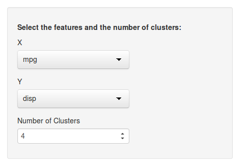
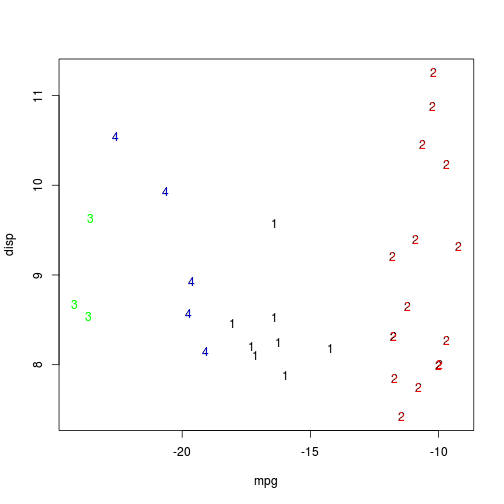

K-means Clusting of the Motor Trend Dataset
========================================================
author: Kent English
date: 2014-10-26

Motivation
========================================================

K-means clustering is a powerful unsupervised machine learning technique. Using the mtcars dataset, which includes features for various cars produced in 1973–74, this app allows the user to explore clusters within those features.

https://zeroviscosity.shinyapps.io/mtcars-kmeans/

The UI
========================================================


server.R
========================================================


```r
library(shiny)
library(stats)
library(fpc)
library(datasets)

shinyServer(
    function(input, output) {
        output$clusters <- renderPlot({
            x <- mtcars[,c(input$x, input$y)]
            fit <- kmeans(x, input$k)
            plotcluster(x, fit$cluster, xlab = input$x, ylab = input$y)
        })
    }    
)
```

Example output
========================================================

As an example, when X is set to *mpg*, Y is set to *disp* and the number of clusters is set to 4, we get the following:

 
